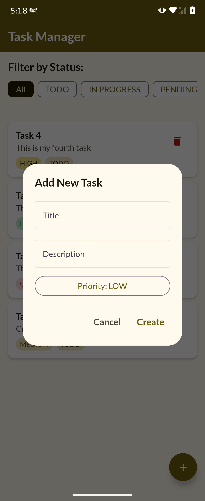
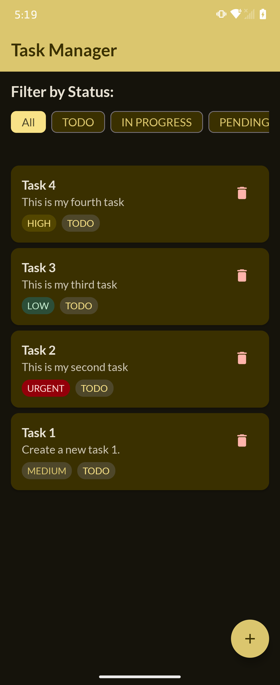
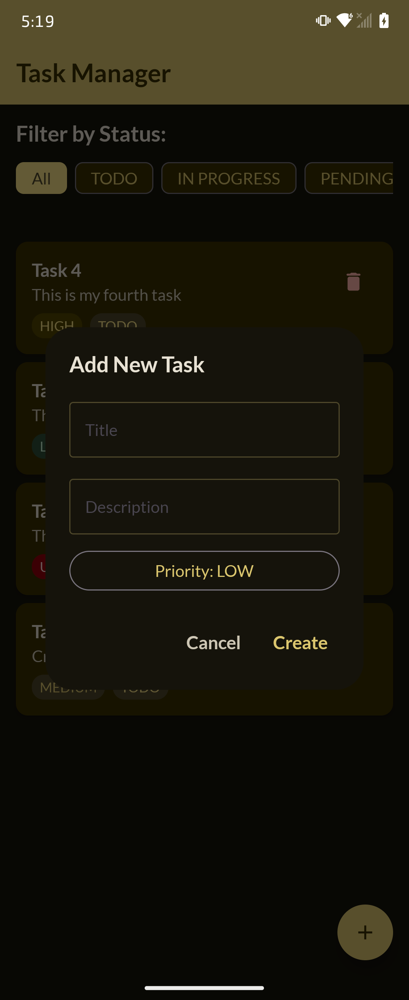

## Task-Manager-Compose (Jetpack Compose Sample)

<div align="center">
  <!-- Screenshots -->
  <div> 
    
    
    
    
  </div> 
</div>

## 1. Project Summary

This project is a production-ready architecture showcase for Android interviews, demonstrating Clean Architecture, MVI, Jetpack Compose, Hilt DI, Room DB, and a custom Material 3 design system — all written in modern Kotlin with KSP-based code generation.

**Task Manager** is a single-screen Android application that allows users to **create, view, update, filter, and delete tasks**. It is built as a learning/interview-preparation project demonstrating:

- **Clean Architecture** — strict separation of Data, Domain, and Presentation layers.
- **MVI (Model-View-Intent)** — a unidirectional data flow pattern for predictable state management.
- **Jetpack Compose** — fully declarative UI with no XML layouts.
- **SOLID Principles** — every class has a single reason to change and depends on abstractions.
- **Custom Design System** — a hand-crafted theme (`MyAppTheme`) built on top of Material 3's `CompositionLocalProvider`, supporting automatic Light / Dark mode.


### 🎉 Core Features

| Feature | Description |
|---------|-------------|
| Create Task | Add a task with title, description, and priority via a dialog |
| View Tasks | Scrollable card list ordered by creation date (newest first) |
| Update Status | Tap a task's status badge to open a dropdown and change it |
| Delete Task | Swipe the delete icon to remove a single task |
| Filter by Status | Horizontally scrollable FilterChips — "All" is selected by default |
| Error Feedback | Errors and success messages surfaced via `SnackbarHost` |
| Dark / Light Mode | Automatic based on system setting via `isSystemInDarkTheme()` |

---


## 2. Architecture Overview

The project follows **Clean Architecture** divided into three layers:

```
┌──────────────────────────────────────────────────────────────┐
│                     PRESENTATION LAYER                       │
│  TaskScreen (Compose UI)  ←→  TaskViewModel (MVI)            │
│  TaskIntent · TaskState · TaskScreen composables             │
└───────────────────────┬──────────────────────────────────────┘
                        │  uses (via constructor injection)
┌───────────────────────▼──────────────────────────────────────┐
│                       DOMAIN LAYER                           │
│  Task (model) · TaskRepository (interface)                   │
│  GetTaskUseCase · CreateTaskUseCase                          │
│  UpdateTaskUseCase · DeleteTaskUseCase                       │
│  TaskTitleValidator · TaskDescriptionValidator               │
└───────────────────────┬──────────────────────────────────────┘
                        │  implements
┌───────────────────────▼──────────────────────────────────────┐
│                        DATA LAYER                            │
│  TaskRepositoryImpl  →  TaskDao (Room)                       │
│  TaskEntity · TaskMapper · TaskDatabase                      │
└──────────────────────────────────────────────────────────────┘
```

**Rule:** Arrows only point inward. The domain layer has **zero** knowledge of Room, Compose, or Hilt.

---

## 3. Project Structure

```
app/src/main/java/com/svp/taskhelpercomposemvi/
│
├── TaskManagerApplication.kt          ← @HiltAndroidApp entry point
├── MainActivity.kt                    ← Single Activity, hosts TaskScreen
│
├── data/
│   ├── local/
│   │   ├── dao/        TaskDao.kt     ← Room DAO (CRUD + Flow queries)
│   │   ├── database/   TaskDatabase.kt← @Database definition
│   │   └── entity/     TaskEntity.kt  ← Room @Entity (stores enums as Strings)
│   ├── mapper/         TaskMapper.kt  ← Bidirectional Entity ↔ Domain model mapping
│   └── repository/     TaskRepositoryImpl.kt ← Implements TaskRepository
│
├── di/
│   ├── DatabaseModule.kt              ← Provides TaskDatabase & TaskDao (@Singleton)
│   └── RepositoryModule.kt            ← Binds TaskRepository → TaskRepositoryImpl
│
├── domain/
│   ├── model/          Task.kt        ← Domain model + TaskPriority + TaskStatus enums
│   ├── repository/     TaskRepository.kt ← Abstract contract (interface)
│   ├── usecase/
│   │   ├── GetTaskUseCase.kt          ← Returns Flow<List<Task>> for a given filter
│   │   ├── CreateTaskUseCase.kt       ← Validates then creates a task
│   │   ├── UpdateTaskUseCase.kt       ← Validates then updates a task
│   │   ├── DeleteTaskUseCase.kt       ← Deletes by id / by object / delete all
│   │   └── TaskFilter.kt (inline)     ← Sealed class: GetAllTask | ByStatus | ByPriority
│   └── validator/
│       ├── TaskTitleValidator.kt      ← Title must be non-blank, max 100 chars
│       └── TaskDescriptionValidator.kt← Description max 500 chars
│
├── presentation/
│   ├── TaskIntent.kt                  ← Sealed class: all user actions
│   ├── TaskState.kt                   ← Immutable UI state snapshot
│   ├── TaskViewModel.kt               ← @HiltViewModel, processes intents, emits state
│   └── TaskScreen.kt                  ← All Compose UI composables
│
└── view/ui/theme/
    ├── AppDesignSystem.kt             ← Data classes + CompositionLocals (colors, type, shape, size)
    ├── AppTheme.kt                    ← TaskHelperComposeMVITheme + MyAppTheme object
    ├── AppFont.kt                     ← Lato FontFamily definition
    └── Color.kt                       ← Full light/dark/medium/high-contrast color palettes
```

---


## 4. How to Run
To run this project, simply clone this repository.
```
https://github.com/pansuriyasumit/Task-Manager-Compose.git
```
Sync the gradle and build the project. To run the app you need to use emulator or real devices. Always checkout the main branch for the latest update.

---

## 5. Tech Stack
1. ***Kotlin*** - Modern programming language for Android development.
2. ***Jetpack Compose*** - Simplified UI toolkit for native Android apps.
3. ***Coroutines*** - Official Kotlin's tooling for performing asynchronous work.
4. ***MVI Architecture*** - MVI is a design pattern for Android apps that helps with a unidirectional data flow pattern for predictable state management, promoting better code organization and testability.
5. ***Room Database*** - Room is an abstraction layer over SQLite, providing an easy and efficient way to work with databases in Android apps.
6. ***Hilt*** - Hilt is a dependency injection library that simplifies managing dependencies in Android apps, reducing boilerplate code and improving maintainability.
7. ***SOLID Principles*** — Implement the SOLID Principle for Implements the SOLID principles for better maintainability and scalability of the project.

---

## 💬 Contact Me

-  Email : pansuriyasumit@gmail.com 
  
---
